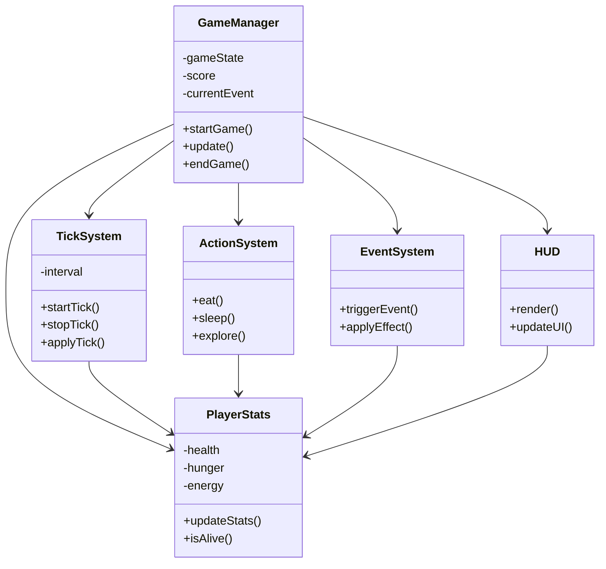
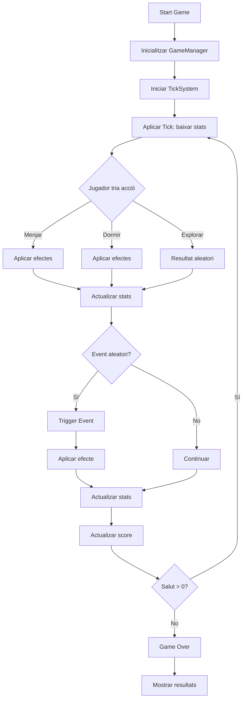

# 01_idea_i_abast.md

## 1. Títol provisional del joc
**Survival Decision Game: Minimal Life Loop**

## 2. Tipus de microvideojoc escollit
Microvideojoc de supervivència basat en decisions i sistema de stats en temps real (tick system), desenvolupat com a addon per a Garry’s Mod utilitzant Lua.

## 3. Objectiu del joc
L’objectiu del jugador és mantenir-se viu el màxim temps possible gestionant correctament les seves estadístiques bàsiques (salut, gana i energia) mitjançant accions simples i la resposta a esdeveniments aleatoris.

No existeix un final narratiu ni una victòria clàssica: el repte és la supervivència sostinguda.

## 4. Rol del jugador
El jugador assumeix el rol d’un personatge sense identitat definida que ha de sobreviure en un entorn abstracte. La seva única responsabilitat és prendre decisions constants per equilibrar les seves necessitats bàsiques.

## 5. Regles bàsiques
- El jugador disposa de tres estadístiques: salut, gana i energia.
- Les estadístiques disminueixen de manera automàtica amb el temps.
- El jugador pot executar accions:
  - menjar: augmenta gana i pot recuperar salut lleument
  - dormir: recupera energia
  - explorar: pot generar recursos o esdeveniments positius/negatius
  - consultar estat: mostra valors actuals de les estadístiques
- Si la gana arriba a 0, la salut comença a disminuir progressivament.
- Esdeveniments aleatoris poden afectar qualsevol estadística.

## 6. Condicions de victòria i derrota
- **Victòria:** no existeix victòria formal.
- **Derrota:** quan la salut arriba a 0, el joc finalitza immediatament i es mostra el temps de supervivència.

## 7. Bucle principal del joc
El bucle principal es basa en un sistema de ticks automàtics:

1. Cada interval de temps (tick):
   - Reducció de gana i energia
   - Possible pèrdua de salut si la gana és crítica
2. El jugador pot executar una acció en qualsevol moment via consola
3. Es comproven condicions de supervivència
4. Es poden activar esdeveniments aleatoris
5. Es repeteix indefinidament fins a la derrota

Aquest bucle és el nucli del gameplay i defineix el ritme del joc.

## 8. Repte principal i dificultat
El repte principal és la gestió eficient de recursos limitats sota pressió temporal constant.

La dificultat augmenta de manera progressiva perquè:
- Les estadístiques baixen contínuament
- Els esdeveniments aleatoris introdueixen incertesa
- Les accions tenen trade-offs (ex: dormir recupera energia però no alimenta)

La complexitat és baixa però la pressió sistèmica és mitjana.

## 9. Limitacions explícites
- No hi ha multijugador
- No hi ha inventari complex
- No hi ha mapa ni exploració espacial real
- No hi ha història narrativa
- No hi ha IA avançada de NPCs
- No hi ha gràfics complexos ni UI avançada
- Interacció limitada a consola i HUD bàsic

## 10. Riscos tècnics
1. Desincronització del sistema de ticks
2. Equilibrat de les estadístiques
3. Gestió d’esdeveniments aleatoris

## 11. Exploració amb IA (mínim 2 prompts + resposta resumida)
Prompt 1:
"Dissenya un sistema de supervivència minimalista amb tres estadístiques i tick system en Lua per Garry’s Mod."

Resposta:
Sistema basat en timers recurrents que modifiquen stats cada interval i funcions modulars per gestionar condicions de derrota.

Prompt 2:
"Com equilibrar un joc de supervivència amb gana, salut i energia?"

Resposta:
Degradació progressiva + events controlats + ajust de dificultat gradual.

## 12. Proposta final escollida
Arquitectura minimalista amb:
- Tick system centralitzat
- 3 estadístiques
- Accions per consola
- Events aleatoris
- HUD simple

## 13. Justificació de viabilitat
Projecte viable en 10 hores perquè:
- Lua senzill
- Sense assets complexos
- UI mínima
- Lògica modular

## 14. Mini pla de treball
1. Setup addon (2h)
2. Stats + tick system (2h)
3. Accions consola (2h)
4. Events aleatoris (2h)
5. HUD (1h)
6. Testing (1h)

## 15. Eines previstes i justificació
- Garry’s Mod
- Lua
- Visual Studio Code
- GitHub
- Console del joc

---

# 🔵 FASE 2 — Disseny tècnic

## 🧱 Diagrama de classes

L’arquitectura separa clarament les responsabilitats. `GameManager` coordina el flux global del joc. `PlayerStats` controla l’estat vital del jugador. `TickSystem` regula el pas del temps i la degradació de recursos. `ActionSystem` encapsula les accions disponibles. `EventSystem` introdueix variabilitat i risc. `HUD` mostra l’estat al jugador. Aquesta estructura facilita el manteniment i permet ampliar el joc sense trencar la lògica existent.

---

## 🔄 Diagrama de comportament

El joc funciona en un bucle continu basat en ticks. Cada iteració redueix les estadístiques i obliga el jugador a prendre decisions. Les accions poden modificar l’estat i activar esdeveniments aleatoris. Després de cada cicle es comprova la supervivència. Si la salut arriba a zero, el joc finalitza. Aquest flux manté una pressió constant i converteix la gestió de recursos en el centre del gameplay.