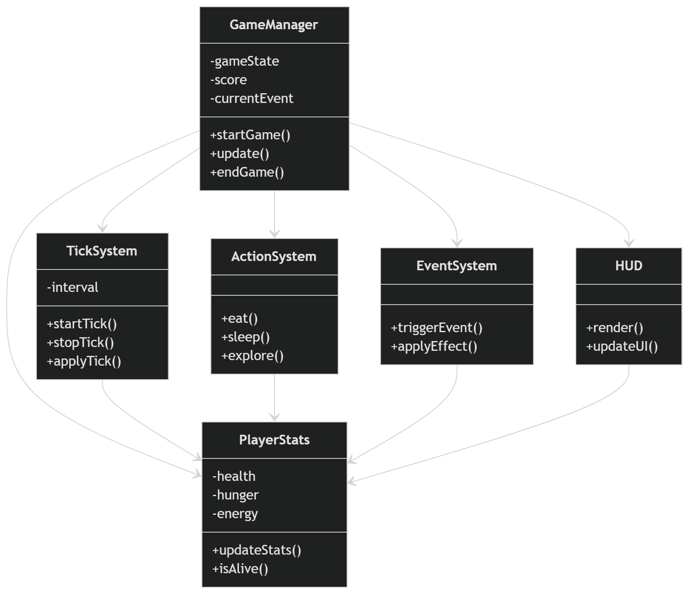
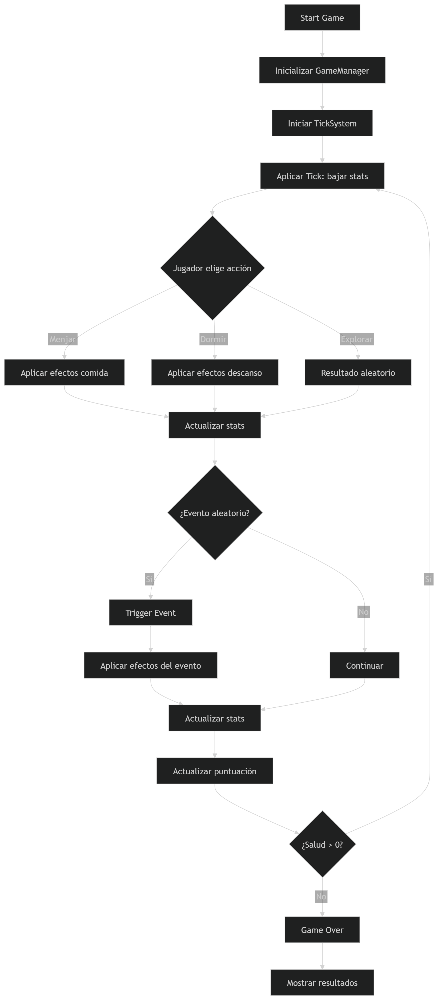

# 01_idea_i_abast.md

## 1. Títol provisional del joc
**Survival Decision Game: Minimal Life Loop**

## 2. Tipus de microvideojoc escollit
Microvideojoc de supervivència basat en decisions i sistema de stats en temps real (tick system), desenvolupat com a addon per a Garry’s Mod utilitzant Lua.

## 3. Objectiu del joc
L’objectiu del jugador és mantenir-se viu el màxim temps possible gestionant correctament les seves estadístiques bàsiques (salut, gana i energia) mitjançant accions simples i la resposta a esdeveniments aleatoris.

No existeix un final narratiu ni una victòria clàssica: el repte és la supervivència sostinguda.

## 4. Rol del jugador
El jugador assumeix el rol d’un personatge sense identitat definida que ha de sobreviure en un entorn abstracte. La seva única responsabilitat és prendre decisions constants per equilibrar les seves necessitats bàsiques.

## 5. Regles bàsiques
- El jugador disposa de tres estadístiques: salut, gana i energia.
- Les estadístiques disminueixen de manera automàtica amb el temps.
- El jugador pot executar accions:
  - menjar: augmenta la gana i pot recuperar salut lleument
  - dormir: recupera energia
  - explorar: pot generar recursos o esdeveniments positius o negatius
  - consultar estat: mostra els valors actuals de les estadístiques
- Si la gana arriba a 0, la salut comença a disminuir progressivament.
- Esdeveniments aleatoris poden afectar qualsevol estadística.

## 6. Condicions de victòria i derrota
- **Victòria:** no existeix victòria formal.
- **Derrota:** quan la salut arriba a 0, el joc finalitza immediatament i es mostra el temps de supervivència.

## 7. Bucle principal del joc
El bucle principal es basa en un sistema de ticks automàtics:

1. Cada interval de temps (tick):
   - reducció de gana i energia
   - possible pèrdua de salut si la gana és crítica
2. El jugador pot executar una acció en qualsevol moment via consola
3. Es comproven condicions de supervivència
4. Es poden activar esdeveniments aleatoris
5. Es repeteix indefinidament fins a la derrota

Aquest bucle és el nucli del gameplay i defineix el ritme del joc.

## 8. Repte principal i dificultat
El repte principal és la gestió eficient de recursos limitats sota pressió temporal constant.

La dificultat augmenta de manera progressiva perquè:
- Les estadístiques baixen contínuament.
- Els esdeveniments aleatoris introdueixen incertesa.
- Les accions tenen trade-offs, per exemple dormir recupera energia però no alimenta.

La complexitat és baixa, però la pressió sistèmica és mitjana.

## 9. Limitacions explícites
- No hi ha multijugador.
- No hi ha inventari complex.
- No hi ha mapa ni exploració espacial real.
- No hi ha història narrativa.
- No hi ha IA avançada de NPCs.
- No hi ha gràfics complexos ni UI avançada.
- Interacció limitada a consola i HUD bàsic.

## 10. Riscos tècnics
1. Desincronització del sistema de ticks.
2. Equilibrat de les estadístiques.
3. Gestió d’esdeveniments aleatoris.

## 11. Exploració amb IA
### Prompt 1
"Dissenya un sistema de supervivència minimalista amb tres estadístiques i tick system en Lua per Garry’s Mod."

### Resposta resumida
Sistema basat en timers recurrents que modifiquen les estadístiques cada interval i funcions modulars per gestionar les condicions de derrota.

### Prompt 2
"Com equilibrar un joc de supervivència amb gana, salut i energia?"

### Resposta resumida
Degradació progressiva, esdeveniments controlats i ajust de dificultat gradual.

## 12. Proposta final escollida
Arquitectura minimalista amb:
- Tick system centralitzat
- 3 estadístiques
- Accions per consola
- Esdeveniments aleatoris
- HUD simple

## 13. Justificació de viabilitat
Projecte viable en 10 hores perquè:
- Lua senzill
- Sense assets complexos
- UI mínima
- Lògica modular

## 14. Mini pla de treball
1. Setup addon (2h)
2. Stats i tick system (2h)
3. Accions per consola (2h)
4. Esdeveniments aleatoris (2h)
5. HUD (1h)
6. Testing (1h)

## 15. Eines previstes i justificació
- Garry’s Mod
- Lua
- Visual Studio Code
- GitHub
- Consola del joc

---

# 02_model_del_joc.md

## 1. Components principals del joc
El joc es construeix sobre sis components principals:

- GameManager: coordina el flux general del joc.
- PlayerStats: gestiona l’estat vital del jugador.
- TickSystem: regula el pas del temps.
- ActionSystem: encapsula les accions disponibles.
- EventSystem: introdueix esdeveniments aleatoris.
- HUD: mostra la informació al jugador.

## 2. Entitats identificades
Les entitats rellevants del sistema són:

- Player: representa el jugador i les seves estadístiques.
- Game: controla l’estat general del joc.
- Event: representa un esdeveniment que altera les estadístiques.
- Action: representa una acció que pot executar el jugador.

## 3. Atributs clau de cada entitat
### Player
- health
- hunger
- energy
- alive

### Game
- state
- score
- running

### Event
- type
- impact
- probability

### Action
- name
- effect

## 4. Accions, mètodes o funcions principals
### Player
- updateStats()
- isAlive()

### Game
- startGame()
- update()
- endGame()

### TickSystem
- startTick()
- applyTick()

### ActionSystem
- eat()
- sleep()
- explore()

### EventSystem
- triggerEvent()
- applyEffect()

### HUD
- render()
- updateUI()

## 5. Explicació del diagrama de classes
El diagrama de classes representa una arquitectura modular separada per responsabilitats.

- GameManager coordina el flux global del joc.
- PlayerStats controla l’estat vital del jugador.
- TickSystem regula el pas del temps i la degradació de recursos.
- ActionSystem encapsula les accions disponibles.
- EventSystem introdueix variabilitat i risc.
- HUD mostra l’estat al jugador.

Aquesta estructura facilita el manteniment i permet ampliar el joc sense trencar la lògica existent.

## 6. Explicació del diagrama de comportament
El joc funciona en un bucle continu basat en ticks. Cada iteració redueix les estadístiques i obliga el jugador a prendre decisions. Les accions poden modificar l’estat i activar esdeveniments aleatoris. Després de cada cicle es comprova la supervivència. Si la salut arriba a zero, el joc finalitza. Aquest flux manté una pressió constant i converteix la gestió de recursos en el centre del gameplay.

## 7. Correspondència entre diagrames i codi futur
La relació prevista entre model i implementació és la següent:

- GameManager → `lua/survival/game.lua`
- PlayerStats → `lua/survival/player.lua`
- TickSystem → `lua/survival/survival_game.lua`
- ActionSystem → `lua/survival/commands.lua`
- EventSystem → `lua/survival/events.lua`
- HUD → `lua/survival/hud.lua`

Cada fitxer representa una responsabilitat concreta i evita barrejar lògica innecessàriament.

## 8. Estructura inicial del repositori
La estructura inicial del repositori és:

- `.vscode/`
- `Diagrames-Fase2/`
  - `diagramaClasses.png`
  - `diagramaComportament.png`
- `lua/`
  - `autorun/`
    - `survival_game.lua`
  - `survival/`
    - `commands.lua`
    - `events.lua`
    - `game.lua`
    - `hud.lua`
    - `player.lua`
    - `survival_game.lua`
- `.gitattributes`
- `README.md`

Aquesta estructura separa inicialització, lògica del joc i documentació visual.

## 9. Primer commit i README inicial
El primer commit del projecte ha d’incloure:
- l’estructura base del repositori
- el fitxer README inicial
- la carpeta `lua` amb l’esquelet del sistema
- les carpetes de documentació i diagrames

Aquest commit deixa constància de l’inici real del projecte i serveix com a punt de partida per al desenvolupament.

---

# 03_diagrames_i_implementacio.md

## 1. Diagrama de classes
El diagrama de classes defineix l’arquitectura funcional del joc i mostra les relacions bàsiques entre els elements principals.

Aquest diagrama està organitzat així perquè:
- separa clarament les responsabilitats
- facilita el manteniment
- permet un desenvolupament modular
- evita que tota la lògica depengui d’un únic fitxer

## 2. Diagrama de comportament
El diagrama de comportament representa el bucle principal del joc i el flux d’accions del jugador.

Aquest diagrama reflecteix el gameplay real perquè:
- hi ha un tick constant
- el jugador actua mentre el temps avança
- les estadístiques es degraden
- els esdeveniments introdueixen variació
- la partida finalitza quan la salut arriba a zero

## 3. Relació entre model i implementació
La traducció del model al codi seguirà aquesta lògica:

- `autorun/survival_game.lua` inicialitza el sistema.
- `survival/game.lua` controla l’estat global.
- `survival/player.lua` gestiona les estadístiques del jugador.
- `survival/commands.lua` implementa les ordres del jugador.
- `survival/events.lua` genera esdeveniments aleatoris.
- `survival/hud.lua` mostra informació a la pantalla.

Això garanteix una correspondència directa entre el disseny i la implementació.

## 4. Objectiu de l’arquitectura
L’objectiu és mantenir un sistema:
- simple
- coherent
- fàcil d’ampliar
- coherent amb la fase 1
- preparat per a programació real en Lua

---

# 04_resum_final.md

## Resum del projecte
Aquest microvideojoc és un sistema de supervivència minimalista per a Garry’s Mod basat en tres estadístiques principals: salut, gana i energia. El jugador ha de gestionar aquests recursos mentre el joc executa un bucle de ticks que degrada progressivament l’estat del personatge.

## Coherència entre fase 1 i fase 2
La fase 2 manté la mateixa idea base definida a la fase 1:
- supervivència
- decisions simples
- pressió temporal
- estructura modular

## Conclusió
El model no és decoratiu, sinó útil per implementar el joc posteriorment. Els diagrames, les entitats i l’estructura del repositori estan pensats per passar directament a codi real sense haver de reinventar l’arquitectura.

---

# 05_documentacio_del_repositori.md

## Estructura del repositori
VIBECODING-GMOD-ADDON/

- `.vscode/`
- `Diagrames-Fase2/`
  - `diagramaClasses.png`
  - `diagramaComportament.png`
- `lua/`
  - `autorun/`
    - `survival_game.lua`
  - `survival/`
    - `commands.lua`
    - `events.lua`
    - `game.lua`
    - `hud.lua`
    - `player.lua`
    - `survival_game.lua`
- `.gitattributes`
- `README.md`

## Explicació breu
- `.vscode/`: configuració de l’editor.
- `Diagrames-Fase2/`: imatges dels diagrames de la fase 2.
- `lua/autorun/`: fitxer d’inicialització del addon.
- `lua/survival/`: codi principal del joc.
- `.gitattributes`: control de line endings i configuració de Git.
- `README.md`: document principal del projecte.

## Primer commit
El primer commit ha de demostrar:
- que el projecte s’ha creat des de zero
- que hi ha una estructura inicial ordenada
- que el README inicial està present
- que la base del projecte ja està preparada per continuar
