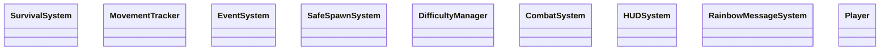
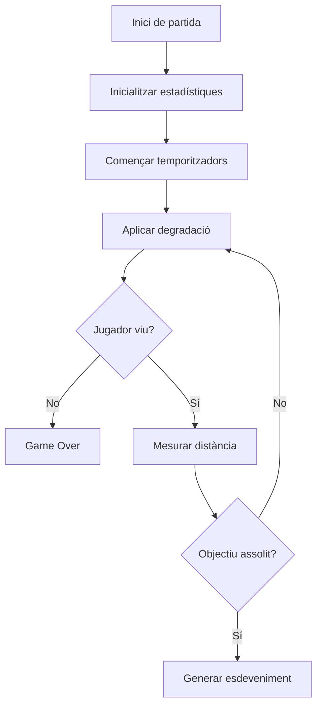

# Survival Decision Game: Minimal Life Loop (Progressive Chaos Edition)

## Descripció general

**Survival Decision Game: Minimal Life Loop (Progressive Chaos Edition)** és un microvideojoc de supervivència desenvolupat com a addon per a **Garry’s Mod** utilitzant **Lua** sobre **Source Engine**.

El projecte combina tres pilars principals:

* Gestió de recursos.
* Exploració basada en moviment real.
* Combat amb dificultat progressiva.

A diferència d'altres jocs de supervivència, els recursos i esdeveniments no apareixen de manera aleatòria ni es poden activar manualment. Tot el sistema gira al voltant del moviment del jugador, incentivant l'exploració constant del mapa.

---

# Vídeo de gameplay

🔗 **Afegir aquí l'enllaç al vídeo de gameplay**

Exemple:

```text
https://youtu.be/XXXXXXXXXXX
```

---

# Característiques principals

## Sistema de supervivència

El jugador disposa de tres estadístiques bàsiques:

| Estadística | Rang    |
| ----------- | ------- |
| Salut       | 0 - 100 |
| Gana        | 0 - 100 |
| Energia     | 0 - 100 |

### Degradació automàtica

* La gana disminueix 1 punt cada 2 segons.
* L'energia disminueix 1 punt cada 4 segons.
* Si qualsevol estadística arriba a 0, el jugador mor.

---

## Exploració basada en moviment

El sistema monitoritza constantment la distància recorreguda pel jugador.

Quan s'assoleix una distància objectiu aleatòria:

* Es genera un nou esdeveniment.
* Poden aparèixer recursos.
* Poden aparèixer enemics.
* Es manté el ritme constant de joc.

Aquesta mecànica elimina la dependència de menús o accions manuals per generar contingut.

---

## Recursos interactius

Tots els recursos existeixen com a entitats físiques dins del món del joc.

### Menjar

* Recupera +35 de gana.
* Es consumeix amb la tecla `E`.

### Llits o matalassos

* Recuperen +30 d'energia.
* Requereixen interacció amb la tecla `E`.

### Botiquins militars

* Recuperen salut.
* Només poden aparèixer quan el jugador té menys del 50% de salut.

---

## Sistema Safe Spawn Anti-Stuck

Per evitar errors de col·lisió:

* Fins a 10 intents de posicionament.
* Comprovació mitjançant traces i raycasts.
* Distància mínima de 120 unitats respecte al jugador.
* Bloqueig d'aparicions dins de geometria sòlida.
* Bloqueig d'aparicions sota el jugador.

---

## Combat i dificultat progressiva

La dificultat augmenta automàticament amb el temps de partida.

### Escalat de dificultat

Cada minut:

* Augmenta el nivell global.
* Incrementa la salut dels enemics.
* Augmenta el nombre d'enemics simultanis.
* Es desbloquegen enemics més avançats.

### Evolució dels enemics

| Temps             | Enemics disponibles                |
| ----------------- | ---------------------------------- |
| Minut 0           | Headcrab, Zombie                   |
| Minut 1           | Variants addicionals               |
| Minut 2           | Zombie Fast                        |
| Minut 3           | Poison Zombie                      |
| Minut 4+          | Caps i combinacions avançades      |
| Partides llargues | Antlion Guard i variants escalades |

### Recompensa de combat

Quan un enemic és eliminat:

* Es reomple tota la munició de les armes del jugador.

Això permet mantenir un ritme de combat continu sense dependre de recollides constants de munició.

---

# Condicions de joc

## Victòria

No existeix una victòria formal.

El rendiment del jugador es mesura mitjançant:

* Temps total de supervivència.
* Minuts superats.
* Nivell de dificultat assolit.

## Derrota

La partida finalitza quan:

* La salut arriba a 0.
* La gana arriba a 0.
* L'energia arriba a 0.

---

# Controls

| Tecla         | Acció                    |
| ------------- | ------------------------ |
| W A S D       | Moviment                 |
| Espai         | Saltar                   |
| Ratolí        | Mirar                    |
| Clic esquerre | Atacar                   |
| E             | Interactuar amb objectes |

---

# Tecnologies utilitzades

| Tecnologia          | Ús                            |
| ------------------- | ----------------------------- |
| Lua                 | Programació principal         |
| Garry's Mod         | Plataforma de desenvolupament |
| Source Engine       | Motor gràfic                  |
| Visual Studio Code  | Entorn de desenvolupament     |
| Sistema Net de GMod | Comunicació client-servidor   |
| NPCs de Half-Life 2 | Sistema d'enemics             |

---

# Arquitectura del projecte

El projecte està dividit en diversos sistemes independents.

## Core Survival System

Gestiona:

* Salut
* Gana
* Energia
* Mort del jugador

## Movement Event System

Gestiona:

* Distància recorreguda
* Activació d'esdeveniments
* Generació de recursos

## Difficulty Manager

Gestiona:

* Escalat de dificultat
* Salut dels enemics
* Oleades
* Selecció de NPCs

## Safe Spawn System

Gestiona:

* Validació de posicions
* Raycasts
* Prevenció d'encallaments

## Combat Reward System

Gestiona:

* Detecció de baixes
* Reompliment de munició

## Client HUD System

Gestiona:

* HUD
* Barres animades amb Lerp
* Notificacions Rainbow

---

# Diagrama de classes


```mermaid
classDiagram
class SurvivalSystem
class MovementTracker
class EventSystem
class SafeSpawnSystem
class DifficultyManager
class CombatSystem
class HUDSystem
class RainbowMessageSystem
class Player
```

---

# Diagrama de comportament


```mermaid
flowchart TD
A[Inici de partida] --> B[Inicialitzar estadístiques]
B --> C[Començar temporitzadors]
C --> D[Aplicar degradació]
D --> E{Jugador viu?}
E -- No --> Z[Game Over]
E -- Sí --> F[Mesurar distància]
F --> G{Objectiu assolit?}
G -- No --> D
G -- Sí --> H[Generar esdeveniment]
```

---

# Instal·lació

## Requisits previs

* Garry's Mod instal·lat.
* Steam actualitzat.
* Accés a una partida local.

## Instal·lació

1. Descarregar o clonar el repositori.
2. Copiar la carpeta de l'addon dins:

```text
garrysmod/addons/
```

3. Iniciar Garry's Mod.
4. Crear una partida.
5. Verificar que l'addon es carrega correctament.

---

# Execució

1. Iniciar una partida de Garry's Mod.
2. Carregar qualsevol mapa compatible.
3. El sistema començarà automàticament.
4. Sobreviure el màxim temps possible.

---

# Limitacions conegudes

* Sense suport multijugador.
* Sense inventari tradicional.
* Sense sistema RPG.
* Utilitza IA nativa de Half-Life 2.
* Centrat exclusivament en supervivència, exploració i combat.

---

# Autor

Afegir nom de l'autor.

---

# Aspectes pendents

Abans de l'entrega final es recomana afegir:

* Enllaç al vídeo de gameplay.
* Captures de pantalla del joc.
* Nom de l'autor.
* Estructura real de carpetes del projecte.
* Enllaç al repositori definitiu.
* Instruccions específiques si existeixen dependències addicionals.
* Llicència del projecte (opcional).